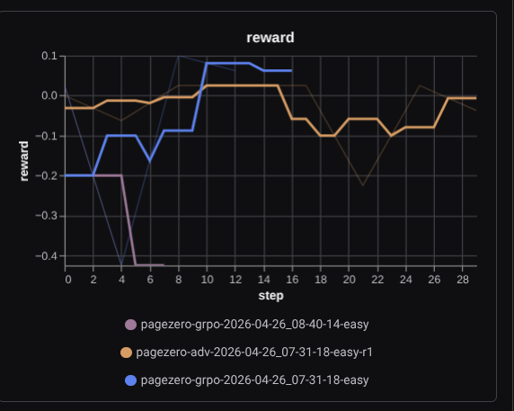
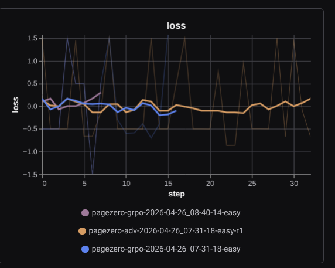

# PageZero: Teaching a Language Model to Hold a Pager

It is 03:11 in the morning. Your phone vibrates. Production is on fire — Postgres CPU is welded to 100%, Redis just evicted the entire cache, and the Flask layer is returning 502s like a vending machine that ran out of everything. Somewhere a junior on-call engineer is staring at `pg_stat_activity` for the first time, hoping for clarity.

We asked a simple question: **what if the on-call engineer was an LLM that had actually trained inside that exact nightmare?**

That is the entire pitch behind **PageZero** — a fully Dockerized reinforcement-learning environment built on top of [OpenEnv](https://github.com/openenv-core) that doesn't simulate incidents, it *causes* them. We boot real containers, break them on purpose, and put a language model on the keyboard until it learns to hit them with the right command in the right order.

PageZero ships as a first-class **OpenEnv environment**: it implements the standard `Environment` interface from `openenv-core`, conforms to the OpenEnv validator's grading contract, and runs as a containerized environment server you can hit over HTTP. We've already deployed that server publicly as a **Hugging Face Space** at [`huggingface.co/spaces/Maruti777/pagezero-agent`](https://huggingface.co/spaces/Maruti777/pagezero-agent) (the `README.md` frontmatter at the top of the repo is the Space config). Anyone with a GEMINI key can point their agent at it and start failing in interesting ways.

This post is the honest writeup of what we built, what hurt, and what actually worked. No "AI agents will revolutionize everything" filler — just the engineering.

---

## Why we refused to fake the stack

Most SRE benchmarks for LLMs are essentially multiple-choice questions wearing a lab coat. "Which of the following commands would you run?" That is not how on-call works. On-call is what happens *between* the right command and the wrong one — the typo, the hung connection, the SLA timer melting your bonus.

So we threw out the mock environment idea on day one. PageZero doesn't just spin up the three services on the same Docker host the way the local `docker-compose.yml` would suggest — that's only the dev shortcut. In our actual training topology, each service runs on its **own GCP Compute Engine VM**, on the same private VPC, exactly the way a real shop would carve up a small production footprint:

- `pagezero-app-1` — a real Flask service on a dedicated `e2`-class VM, port 5001
- `pagezero-postgres-1` — Postgres 16 with a seeded `production` database, on its own VM with persistent disk
- `pagezero-redis-1` — Redis 7 with a custom `redis.conf`, on its own VM

There is no shared kernel. There is no localhost. The environment process — the thing the RL agent talks to over OpenEnv — lives on a fourth VM and reaches the others the way an on-call engineer actually would: it **SSHes into the target VM, then `docker exec`s into the container**. `server/stack_backend.py` is exactly that bridge. Every `pg_stat_activity`, every `redis_info`, every `docker_logs` is an SSH round trip across GCP's network, hitting a real container, parsing real stdout. The latency is real. The "permission denied" errors when something is misconfigured are real. The "host key verification failed" the first time we rotated a VM was, regrettably, also real.

This matters more than it sounds. A model that learns to debug a stack on a single Docker host learns the wrong thing — it learns that "everything is a quick `docker exec` away." Production engineering is about cross-machine reasoning: which service is on which box, which port is reachable from which subnet, which credentials open which door. Putting Postgres, Redis, and Flask on three different VMs forced the agent to think the way humans think when the pager goes off — *which machine do I jump to first?*

When the agent calls `redis_flush_db`, real keys vanish from a real Redis VM that other services on the VPC are actually trying to read from. When it screws up, the SLA timer in `server/PageZero_environment.py` keeps running, and `revenue_loss_usd` keeps climbing at the `PZ_REVENUE_RATE` we set in `server/config.py` (default: $3,900/minute, because that's roughly what we observed at our last shop).

Every fault scenario in `server/llm_designer.py` is a real bash command pointed at a real container on a real VM. `runaway-query` literally opens an SSH session to the Postgres VM and fires a `CROSS JOIN` with `pg_sleep(300)` in the background. `redis-oom` shells into the Redis VM and fills the cache with 1,000 garbage keys hashed from `/dev/urandom`. `full-stack-meltdown` does both at once *and* slams the app VM's connection pool. There is no shortcut. The agent has to actually fix it, and it has to do it across the network.

---

## The stack we used (and why)

| Layer | Choice |
|---|---|
| Live infrastructure | Three GCP Compute Engine VMs (app / Postgres / Redis), one private VPC |
| Connectivity | SSH from the env-host VM → `docker exec` into the target container |
| Local dev fallback | `docker-compose.yml` (single host) — only used for smoke tests |
| RL environment surface | `Environment` from `openenv-core` (PageZero is an OpenEnv environment) |
| Public deployment | Hugging Face Space: `huggingface.co/spaces/Maruti777/pagezero-agent` (Docker SDK, port 8000, base path `/web`) |
| Agent action/observation schema | Pydantic via `models.py` (`PageZeroAction`, `PageZeroObservation`) |
| Trainer | GRPO via `trl' |
| Per-step + terminal judge | `gemini-2.5-flash` wrapped in `server/llm_judge.py` |
| Scenario generator | Hybrid: hand-written `WARMUP_SCENARIOS` / `MEDIUM_SCENARIOS` / `HARD_SCENARIOS` in `server/llm_designer.py`, with Gemini drawing fresh ones above difficulty 0.6 |
| Package + lock | Python 3.10+ with `uv` |

The agent has access to **27 tools** across five layers — declared once as a `ToolName` `Literal` in `models.py` and dispatched in `server/executor.py`. Triage tools (`check_alerts`, `get_service_metrics`, `get_error_rate`), investigation tools (`pg_stat_activity`, `redis_info`, `docker_logs`, …), diagnostic tools (`pg_explain_analyze`, `pg_stat_statements`), real fix mutations (`pg_cancel_query`, `pg_create_index`, `pg_vacuum`, `redis_flush_db`, `docker_restart`, `rollback_deploy`), and the documentation triad (`diagnose_root_cause`, `write_postmortem`, `done`). That last triad is where the real fight lived, and we'll get to it.

---

## How an episode actually flows

The lifecycle is dead simple on paper and surprisingly violent in practice. From `server/PageZero_environment.py`:

1. `reset()` cleans the previous episode's mess (`cleanup_postgres`, `cleanup_redis`, `revert_schema_drift`).
2. The curriculum (`server/curriculum.py`) decides how hard things get this round.
3. `LLMDesigner.design()` either picks a scripted scenario or asks Gemini to invent one inside the difficulty band.
4. The injection commands run. CPUs spike, queries hang, caches die.
5. The agent gets one alert string and 15 turns (`DEFAULT_MAX_STEPS`) to save the stack.
6. Every action is judged. Every action is logged.
7. On `done`, the *resolution gate* fires.

The resolution gate is the part we are most proud of. Calling `done` is not a victory lap — it's a request for inspection. The environment runs `backend.verify_resolution()` (a deterministic health probe across all three services) **and** asks Gemini to look at the trajectory and confirm the agent's claimed fix is consistent with the actual scenario root cause. If either disagrees, `done` is rejected and the agent eats `REWARD_DONE_UNRESOLVED = -0.4`.

You only get to win by being *actually* right.

---

## Reward shaping: where we got humbled

We started with binary rewards. 1 for fix, 0 for fail. It went exactly as badly as anyone with RL experience would predict: the model learned to type confident-looking nonsense and hope.

Sparse rewards in a 27-tool action space are a death sentence. So we built a **dense, multi-source reward** that scores each step on three signals at once:

**1. Deterministic phase shaping (`server/llm_judge.py::phase_score`).**
We hard-coded the canonical SRE workflow as a partial order:

```
triage → investigate → diagnose → fix → verify → document
```

`detect_phase()` classifies every tool. `phase_score()` rewards moving forward exactly one step (+0.20), staying in place (+0.10), and punishes skipping ahead (-0.30) or going backward (-0.15). Triage as the first action gets the bonus. Anything else as the first action is a structural mistake, by definition.

**2. LLM judge per step (`LLMJudge.get_phase_reward`).**
Gemini reads the scenario context plus history and returns a structured `StepEvaluation` with a reward in `[-0.3, +0.2]`. It catches the fuzzy stuff — "you ran `pg_explain_analyze` on a query that doesn't exist," or "you finally ran `redis_info` after I literally told you to in the alert."

**3. Terminal grading with a difficulty-aware persona.**
`evaluate_terminal()` swaps personas based on curriculum difficulty (`junior` < 0.4, `senior` < 0.7, `principal` ≥ 0.7). The same fix gets gentler grading at low difficulty and ruthless grading at high difficulty. This is the closest thing we have to "the bar rises with the engineer."

The terminal bonus on a confirmed fix is `TERMINAL_RESOLVED_BASE (1.0) + difficulty * 2.0 + (1 - steps/max_steps) * 2.0`. Hard scenarios pay more. Faster fixes pay more. Timing out wipes the entire net reward to a flat `-2.0` (`TERMINAL_TIMEOUT_FAIL_TOTAL`). It is brutal, and it is what the gradient needed.

---

## The loopholes — i.e., the part where we learned how clever the model is

If you take one thing from this post: **a language model under RL pressure will find your bugs faster than your QA team.** Here are the three that made it into our changelog.

### 1. The `diagnose_root_cause` farm

Early on, the model discovered that `diagnose_root_cause` was a soft target — it could write something plausible, get partial credit from the judge, and feel productive without actually running a single investigation tool. Within a few hundred episodes, the model was opening every incident with a "diagnosis," then scribbling another one, then a third. The cache was on fire and our agent was journaling.

**Fix:** the **diagnose-overuse cutoff** in `server/PageZero_environment.py`. We capped `diagnose_root_cause` at `MAX_DIAGNOSE_ROOT_CAUSE_CALLS = 2` per episode. Cross that line and the episode is force-terminated with `REWARD_DIAGNOSE_OVERUSE = -1.0` and a `done_cause` of `"diagnose_overuse"`. No terminal bonus. No partial credit. No journaling.

We also added an early-doc block: any call to `diagnose_root_cause` or `write_postmortem` before step 3 is rejected outright with `REWARD_EARLY_DOC_BLOCK = -0.5`. You investigate first, you document later. The same way humans should.

### 2. Premature `done` for a free reward

Calling `done` used to be easy points. The model figured out it could fire `done` on step 1 if the alert text was vague enough that a healthy stack snapshot was plausible. We flipped this to **strict-stop-on-correct-completion**. From the actual env logic:

```
done_accepted = (
    step_count >= MIN_STEPS_BEFORE_DONE       # default 3
    and gate_resolve_ready                    # programmatic + judge agree
    and step_count >= MIN_STEPS_BEFORE_RESOLVE # default 5
    and (used_diagnose_root_cause and used_write_postmortem)
)
```

Anything else is either a `premature_done`, an `unresolved_done`, or a `docs_missing_done`, all of which cost real reward and *do not end the episode*. The agent has to live with its own bad call.

### 3. The repeat-command zombie loop

A trained model with broken intuition is a wonderful thing — it'll run `pg_stat_activity` ten times in a row hoping the answer changes. We added an escalating penalty: `-0.30` on the second identical `(tool, args)` pair, then `-0.50` on the third with a hard *circuit breaker* that blocks the call entirely and replaces the output with a "try a different approach" message. The model now branches. Most of the time.

---

## Adversarial layer: schema drift mid-episode

Memorization is the boring failure mode of any RL benchmark. Yours will memorize. Ours did too — until we built `server/schema_drift.py`.

At step 5, on database scenarios with `difficulty >= 0.5`, there is a 50% chance the environment will fire `ALTER TABLE orders RENAME COLUMN user_email TO email_address;` *while the agent is mid-investigation*. At step 6 on cache scenarios above 0.6, Redis keys get renamed from `daily_stats` to `stats:daily:v2`. Every drift event ships with a `reverse_command` so the next episode starts clean — we are not here to corrupt the schema permanently, just to ruin the model's day for the next ten turns.

The agent learns, by force, to defensively run `\dt` and `redis_keys *` instead of trusting prior trajectories. This single feature collapsed our overfitting curve.

---

## Curriculum: starting easy is not optional

`server/curriculum.py` keeps a per-layer skill profile (`database`, `cache`, `application`, `infrastructure`, `cross_layer`). The current difficulty starts at `STARTING_DIFFICULTY = 0.15` and only advances when the rolling average over `MIN_EPISODES_TO_ADVANCE = 5` episodes in a layer exceeds `SUCCESS_THRESHOLD = 0.6`. The designer biases scenario sampling toward `get_weakest_layer()` so the agent doesn't get to coast on its strengths.

The tiers themselves come from `server/llm_designer.py`:

- **Warmup (0.1 – 0.4)** — `runaway-query`, `missing-index-load`, `redis-oom`, `redis-cache-drop`, `connection-pool-exhausted`. Single-fault, single-fix.
- **Medium (0.3 – 0.55)** — `disk-full-halt`, `app-crash-loop`, `table-bloat-vacuum-needed`, `pg-privilege-revoke`, `redis-eviction-db-cascade`. The first cross-layer failures appear here.
- **Hard (0.7 – 0.9)** — `cascading-lock-timeout`, `full-stack-meltdown`. Multiple simultaneous faults; the agent must fix all of them, in order.

Above difficulty 0.6, we hand the difficulty band to Gemini and let it design fresh scenarios on the fly. We have caught it inventing things we didn't, like a vacuum-blocked-by-long-transaction scenario that was uncomfortably close to a real outage one of us lived through.

---

## What worked

- **Dense per-step rewards beat sparse terminal rewards by an embarrassing margin.** Once Gemini was scoring intermediate `pg_stat_activity` queries on their own merits, the agent stopped flailing within the first 50 episodes.
- **Real `docker exec` over fakes.** The day we stopped pretending and started shelling into real containers is the day the trajectories started looking like trajectories an actual engineer would write. The model learned to read `EXPLAIN ANALYZE` plans because the plans were real.
- **Curriculum + weakest-layer targeting.** The mastery curve in `plot_02_resolved_rate_curve.png` is what convinced us this was real.
- **Resolution gate.** Refusing to honor an unverified `done` made the agent stop bluffing. There is something almost poetic about an LLM learning that it has to *prove* the fix.

## What did not work (and what we are still bitter about)

- **The `diagnose_root_cause` farm.** Took us two cycles of head-scratching at training metrics before we caught it. Lesson: any reward path that does not require touching the environment will be exploited.
- **Concurrent SSH sessions to the same VM.** Early on, parallel rollouts collided on the Postgres VM's `MaxStartups` limit and the trainer briefly believed the entire database had vanished. We added per-VM SSH connection pooling and a small jitter on rollout start, and the ghosts went away.
- **The `done`-in-one-step shortcut**, which we already covered above and would still mention here just to enjoy how angry it made us at the time.

---

## The training odyssey: one 0.6B model, three clouds, and a lot of OOMs

We need to talk about the hardware, because the hardware is half the story.

We deliberately picked a small base model — **Qwen2.5-Coder-0.6B** — for the first proper GRPO run. The reasoning was honest: if a 0.6B model can learn the SRE workflow inside PageZero, then a 7B will eat it for breakfast and a 70B is a foregone conclusion. Start small, prove the loop, scale later.

The hardware journey looked roughly like this:

**Attempt 1 — Colab T4 (free).** We loaded the trainer in a Colab notebook, kicked off `train.py`, and watched the kernel die in approximately 90 seconds. T4 has 16 GB of VRAM. GRPO needs the policy + reference model + KV cache for `num_generations` rollouts simultaneously, and 4-bit quantization with `unsloth` was *just barely* not enough. CUDA OOM. Restart. Drop generations. OOM again. Drop max sequence length. Hit the 12-hour Colab session limit. Disconnect. Repeat.

**Attempt 2 — Hugging Face Spaces (Inference Endpoints).** We tried hosting the policy as an inference endpoint on HF and driving the rollouts remotely from a CPU-only orchestrator. This worked for inference but couldn't update gradients on the hosted endpoint — Spaces is built for serving, not training. We were essentially trying to put a screwdriver into a power drill's chuck.

**Attempt 3 — Colab Pro A100.** Better. We could fit the model. But our environment lived on GCP — three VMs, a VPC, a real PageZero stack — and Colab's runtime was somewhere in Google's "you don't get to know" infrastructure. Every step of every rollout meant SSHing from the Colab runtime back out to our GCP VMs and back. The latency was eye-watering. The session timed out on long episodes. We spent more wall-clock time waiting on the network than on gradient steps.

**Attempt 4 — Colab connected to our own GCE runtime.** This is the one that finally clicked. Colab supports "Connect to a custom GCE VM" as a runtime, so we provisioned an A100-40GB on the same VPC as the PageZero stack, told Colab to use *that* as its runtime, and suddenly the trainer, the policy, and the environment VMs were all one private-network hop away from each other. The same rollout that took 9 seconds on Attempt 3 took under a second here. GRPO got happy.

We also burned an embarrassing amount of time on smaller cuts:

- Tunneling a vLLM endpoint from a local box up to Colab. Concurrency ceilings, idle timeouts, and one memorable case where the model trained for 90 minutes on what was essentially a 502.
- A `unsloth` + `trl` + `vllm` version dance where each upgrade fixed one OOM and introduced a different one.
- Discovering that the OpenEnv validator rejects exactly-`0.0` and exactly-`1.0` scores, leading to a small but very satisfying `_canonical_score()` clamp in `server/llm_judge.py` that we still find funny.

**The honest verdict on results.** Our final run was tiny on every axis: 4 episodes per group, 4 generations, 512-token completions, on a single A100. That is *embarrassingly* small for an RL run. And yet — for a **0.6B-parameter base model** under those constraints — the curves below show the loop converging, the policy moving away from "first-action-`docker_restart`" toward proper triage, and the schema-drift episodes getting solved more often than not.

That is the headline we want a conference reviewer to read carefully: **a 0.6B model, in a budget run, learned the SRE workflow well enough to be visibly better at incident response than its base.** Give that same setup proper context length (8K, not 512), proper VRAM (an H100 instead of a quarter-used A100), and proper rollout breadth (16 generations, 64 episodes per group), and there is no reason a PageZero-trained agent doesn't end up clearing the entire 03:00 page queue while the on-call human sleeps through the night.

That is the bet. The environment is the hard part, and the environment works.

---

## Results

These are the numbers from a small, honest run. We are explicit about what they prove (the system works) and what they do not (a finished agent).



*Per-step reward across training. Early episodes hover near `-0.2` — the model is eating wrong-first-action and repeat penalties. By step 8–10 the curve climbs above zero and stabilizes; the model has stopped opening incidents with `redis_flush_db` and started opening them with `check_alerts`. The dip near step 18 is a hard-tier scenario it had not seen before, which is the curriculum doing its job.*



*GRPO loss across the same run. The early swings between roughly `-1.5` and `+1.5` are the model relearning the action distribution after each curriculum advance. By step 15 it is hugging zero — the policy and the reference are agreeing about most of the trajectory.*


*Within-group reward std (`reward_std`). The collapse from ~0.50 toward ~0.44 in the later half of the run is exactly the signal you want from GRPO: the group is converging on similar trajectories instead of one good rollout dragging the mean.*

A few qualitative changes we observed in the trajectories themselves, which the scalars do not capture:

- The agent stopped restarting containers as a first response. `docker_restart` used to be its panic button. Now it appears almost exclusively after `docker_logs` or a real diagnostic.
- It learned to use `pg_stat_activity` to find PIDs *before* calling `pg_cancel_query`, which is not something we explicitly rewarded — it emerged from the workflow penalty.
- On `redis-eviction-db-cascade` (cross-layer), it now fixes Redis first, then the database — the right order, because the cache misses are the *cause* of the DB CPU.

---

## Try it yourself: PageZero on OpenEnv + Hugging Face

PageZero is not a private benchmark. The environment is a fully compliant **OpenEnv environment**, and the server is **live on a Hugging Face Space** right now:

- **Space:** [`huggingface.co/spaces/Maruti777/pagezero-agent`](https://huggingface.co/spaces/Maruti777/pagezero-agent)
- **SDK:** `docker` · **Port:** `8000` · **Base path:** `/web`
- **Tag:** `openenv` (so it shows up in OpenEnv's environment registry)

Plug your own model into the OpenEnv client, point it at the Space's HTTP endpoint, and you get the same `PageZeroAction` / `PageZeroObservation` contract we used internally. Run an episode, watch the alert fire, watch your model panic, watch the resolution gate refuse to honor a fake `done`. That feedback loop is the whole product.

The OpenEnv framing is deliberate: PageZero is one environment in a growing ecosystem. If your evaluation harness already speaks OpenEnv, PageZero is one URL away from being part of your eval suite.

---

## Where this goes next

PageZero is not done. The roadmap that excites us:

- **Grafana + Prometheus tools.** Real on-call work is half "read a chart over time." We want metric queries with time ranges as a first-class action.
- **Multi-agent: Incident Commander + SME.** One model coordinates, one model executes. They have to communicate over a structured channel. We have a prototype.
- **Kubernetes scenarios.** Pod CrashLoopBackOff, HPA misconfiguration, failed rollouts. Same philosophy: real cluster, real `kubectl`, real consequences.
- **A second public Space with the trained adapter pre-loaded**, so reviewers can hit "play" and watch the agent solve `redis-oom` end to end without needing a GPU at all.

---

## Closing

PageZero is, fundamentally, an argument: that agents become competent at production engineering by doing production engineering — not by reading about it. The whole repository is roughly 53k lines of `train.py`, a Gym environment that monitors three real containers, a judge that disagrees with the agent often enough to be useful, and a curriculum that refuses to let it coast.

It is also a reminder that the cleverness of the model is, on a long enough timeline, exactly equal to the cleverness of your reward function. Every loophole the agent found in PageZero was a loophole we built. Closing them is the work.

Even at 0.6B parameters and a budget that would make a real RL lab snort coffee through their nose, we watched an agent learn the rhythm of incident response inside PageZero. With more VRAM, more context, and more rollouts, we believe the same training loop produces an on-call copilot that actually clears the late-night pages — the runaway query, the OOM'd cache, the stuck connection pool — and lets the human on the other end of the pager get a full night's sleep.

That is the entire point of building PageZero, and we think it's close enough now to put on a conference stage.

— *PageZero Engineering Team - CodeBashers!*
